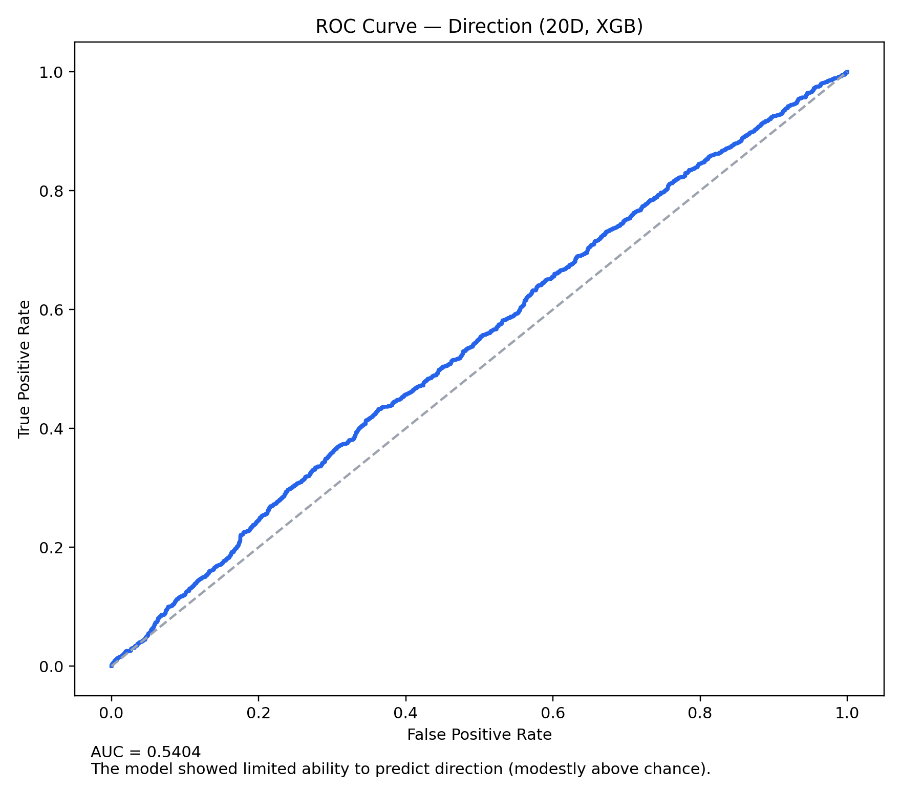
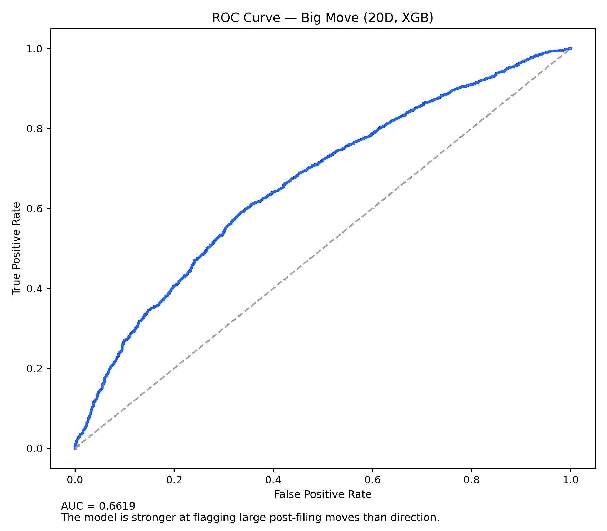
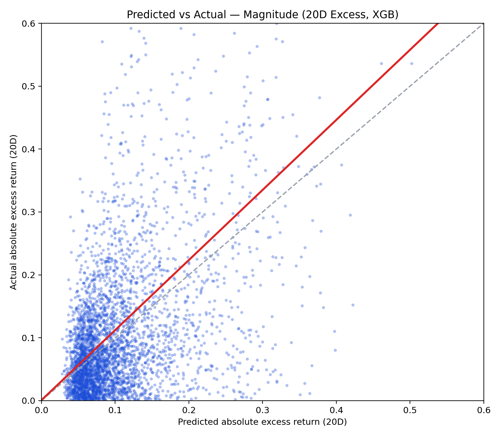
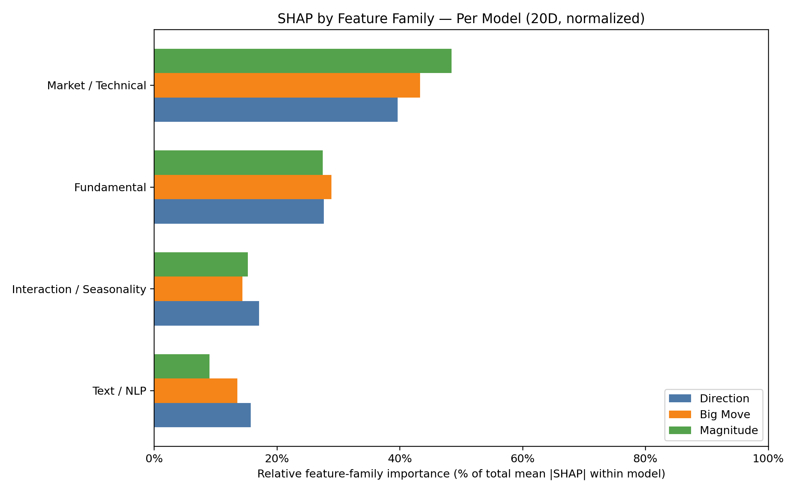

# Predicting Post-Filing Excess Returns from SEC 10-K/10-Q Data

MGTF 423 Final Project — Ryder, UC San Diego Rady School of Management

## What this project does

Every time a public company files a 10-K or 10-Q with the SEC, the market has to digest a dense package of financial statements and narrative disclosures. This project asks a simple question: **can we systematically predict the 20-day post-filing excess return (vs. SPY) using features derived from the filing itself, the company's financials, and the stock's recent market behavior?**

The universe is consumer-sector stocks (discretionary + staples). The approach combines three signal families — fundamental accounting ratios, market/technical state at filing time, and NLP-derived text features from FinBERT — into XGBoost models evaluated on three tasks with a strict chronological train/val/test split (70/10/20).

## Results

| Task | Model | Metric | Test |
|---|---|---|---:|
| Direction | XGBoost | AUC | 0.5403 |
| Big Move | XGBoost | AUC | 0.6616 |
| Magnitude | XGBoost | R² | 0.1350 |

The headline finding is that **predicting whether a big move will happen is substantially easier than predicting which direction it goes.** A 0.54 AUC on direction is barely above coin-flip. A 0.66 AUC on big-move detection is a real signal — the model can identify filings that precede abnormal volatility, even if it can't reliably tell you which way.

The magnitude regression captures ~13.5% of variance in absolute excess returns. Not strong in isolation, but the predicted magnitude scores do rank-order realized returns: the decile spread between the model's most and least confident predictions is economically meaningful.

### Direction ROC



AUC of 0.54. The model is only slightly better than random at calling the sign of the excess return. This is consistent with the efficient-markets prior — directional edge from public filings should be hard to find.

### Big Move ROC



AUC of 0.66. This is the strongest result. The model picks up on combinations of market state and filing characteristics that precede large absolute moves. Economically, this makes sense — a stock sitting near its 52-week low with deteriorating margins and a long, unusually worded filing is more likely to move big after the filing drops, regardless of direction.

### Magnitude: Predicted vs. Actual



The scatter is noisy but the regression line (red) has a positive slope — higher predicted magnitude loosely corresponds to higher realized magnitude. The model isn't precise enough for point estimates, but it's useful for ranking filings by expected move size.

### SHAP Feature Importance by Family



Feature importance varies meaningfully across the three tasks. Market/technical features dominate the direction model (momentum, drawdown, vol state), while the big-move and magnitude models draw more heavily on fundamentals and text features. This supports running task-specific models rather than a single multi-purpose model.

## Data

**Sources:**
- SEC EDGAR filings (10-K, 10-Q) for the consumer-sector universe
- SEC Company Facts API (XBRL) for structured financial statement data
- Yahoo Finance for daily price/volume/returns
- FinBERT transformer model for section-level filing sentiment

**Granularity:** one row per filing event, keyed by `ticker + accession + filed_date`.

**Feature count:** 69 post-pruning (see [`FEATURES.md`](FEATURES.md) for the full list and family groupings).

Feature families: fundamental accounting ratios (margins, growth rates, leverage), market/technical state at filing date (momentum, volatility, drawdown, distance to 52-week high), text/NLP signals (FinBERT sentiment scores, filing length surprise, sentiment dispersion), sector/regime indicators, and a few interaction terms.

## How to run it

### Quick path (professor notebook)

Open `pr_pipeline.ipynb` and run all cells. The notebook builds features from Postgres, trains models, prints metrics, and renders all charts inline.

Writes `docs/MAIN_TRAIN_EVAL_SUMMARY.md` with the full results table, SHAP ranking, and decile check.

### Environment setup

```bash
python3 -m venv .venv
source .venv/bin/activate  # Windows: .venv\Scripts\Activate.ps1
pip install -r requirements.txt
```

Requires `DATABASE_URL` pointing to the Postgres instance with loaded tables (`financials`, `market_data_daily`, `finbert_section_scores`).

## Pipeline

1. **Ingest:** Download filings from SEC EDGAR, pull financials from XBRL Company Facts, download daily returns from Yahoo Finance. (~ 1 hour of runtime)
2. **Score text:** Run FinBERT over MD&A and Risk Factors sections (~4 hours on a RunPod A40 GPU). Produces section-level sentiment scores.
3. **Build features:** Join financials, market data, and text scores at filing granularity. Engineer ratios, growth rates, momentum signals, interaction terms. Prune weak/redundant features.
4. **Model:** XGBoost classifiers (direction, big move) and regressor (magnitude) with time-ordered split. No future information leaks into training.
5. **Evaluate:** ROC curves, SHAP decomposition, decile portfolio check.

## Methodology notes

**Split:** Strict chronological — train on the oldest 70% of filings, validate on the next 10%, test on the most recent 20%. No shuffling, no cross-validation, no lookahead.

**Targets:** All targets are computed from *forward* returns starting the day after `filed_date`. Excess return = stock compound return minus SPY compound return over the same window.

**Known caveats:**
- The consumer-sector universe is narrow. Results may not generalize to other sectors or the broad market.
- Direction AUC of 0.54 is not actionable as a standalone trading signal. The project's value is in the big-move and magnitude results, and in the feature-importance decomposition showing *what information the market is slow to price*.
- Analysis assumes no liquidity or slippage which is highly unrealistic

## Repo structure

```
├── data_collection/          # download scripts (filings, returns)
├── data_processing/          # extract, score (FinBERT), build features
├── modeling/                 # train/eval scripts, chart generation
├── stock_universe/           # ticker lists, sector labels
├── visuals/                  # output charts (ROC, SHAP, scatter)
├── docs/                     # generated reports (metrics, SHAP tables)
├── pr_pipeline.ipynb         # professor-facing notebook (runs everything)
├── FEATURES.md               # full feature list + family groupings
└── README.md
```